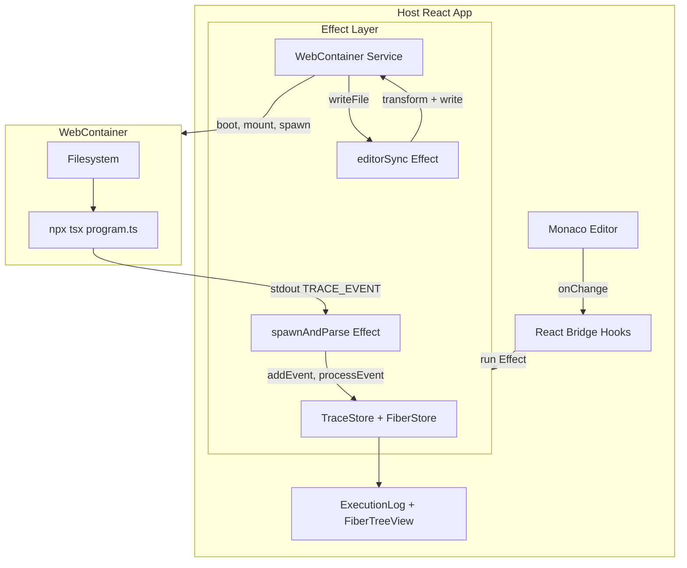

# WebContainers Run Feature Implementation Plan

> Implementation plan for the [WebContainers spec: run edited program in the visualizer editor](webcontainers-spec.md).

## Summary

Migrate from host-side execution to **WebContainer execution**: the edited program runs in a container; trace events stream over stdout to the host; the UI (ExecutionLog, FiberTreeView) stays unchanged.

---

## Phase 1: Prerequisites (Headers + Dependency)

### 1.1 COOP/COEP Headers

WebContainers require SharedArrayBuffer, which needs cross-origin isolation.

**Dev (Vite):** Add to `[vite.config.ts](vite.config.ts)` under `server.headers`:

```ts
server: {
  headers: {
    "Cross-Origin-Embedder-Policy": "require-corp",
    "Cross-Origin-Opener-Policy": "same-origin",
  },
},
```

**Prod:** Create `[vercel.json](vercel.json)` with headers for all routes and Monaco workers. Per spec section 10, Monaco workers (editor.worker, ts.worker, json.worker) must also receive these headers. Vite/Rolldown output paths for workers need to be checked and added to `vercel.json` source patterns.

### 1.2 Add `@webcontainer/api`

**Dependency:** Install `@webcontainer/api` (ask user for permission first per AGENTS.md).

---

## Phase 2: tracedRunner Bundle and Inner Project

### 2.1 tracedRunner Bundle

Create a separate build output for the **inner project**. The bundle must:

- Include `tracedRunner.ts` + `traceEmitter.ts`
- Target Node/ESM for `npx tsx` inside the container
- **Preserve export names** (`withTrace`, `forkWithTrace`, `makeTraceEmitterLayer`, etc.) — use `minify: false` or `keepNames: true`
- Output to a path that can be loaded and mounted (e.g. `dist/tracedRunner.js`)

**Options:**

- **Vite lib mode:** Add a second entry or separate config for `src/runtime/tracedRunner.ts` (with traceEmitter as dependency). Use `build.lib.rollupOptions.output` with `format: 'es'`, `minify: false`.
- **esbuild script:** Small script that bundles `tracedRunner.ts` → `dist/tracedRunner.js` with esbuild, preserving names.

Recommended: **Vite lib mode** so one build produces both app and tracedRunner bundle.

### 2.2 tracedRunner.d.ts (Emit from Build)

Emit `tracedRunner.d.ts` from the build for Monaco type resolution. No hand-maintained type files.

**Approach:** Add a build step (or configure the tracedRunner lib build) to emit `.d.ts`:

- **tsc:** `tsc --declaration --emitDeclarationOnly` for `tracedRunner.ts` + `traceEmitter.ts`
- **Vite lib:** If using `build.lib`, enable `declaration: true` (or a separate tsc declaration-only pass for the runtime entry)
- Output alongside `tracedRunner.js` (e.g. `dist/tracedRunner.d.ts`)

Add the emitted content as Monaco extra lib so `import { withTrace } from './tracedRunner'` resolves.

### 2.3 Inner Project Template

**Two distinct representations:**

1. **App/UI template** (for editor state, tabs, active file): Use a structure like [Frontend Hire's](https://www.frontendhire.com/learn/frontend/courses/stackpack/building-code-editor#thinking-our-code-template): `{ files: Record<string, { contents: string }>, entry: string, visibleFiles: string[] }`. This drives which file is shown, which tab is active, etc.
2. **WebContainer mount format** (for `webcontainer.mount()`): Use the [FileSystemTree](https://webcontainers.io/guides/working-with-the-file-system) shape exported by `@webcontainer/api`:
   - **Files:** `{ "path/to/file": { file: { contents: "..." } } }`
   - **Directories:** `{ "dirname": { directory: { "nested.js": { file: { contents: "..." } } } } }`

Convert from the app template into `FileSystemTree` when calling `mount()`. For our flat layout (all files at root), the mount object is: `{ "package.json": { file: { contents } }, "tsconfig.json": { file: { contents } }, "tracedRunner.js": { file: { contents } }, "program.ts": { file: { contents } } }`.

**Files to mount:**

- **package.json** — Dependencies: `effect`, `typescript`, `tsx`.
- **tsconfig.json** — Minimal TS config.
- **tracedRunner.js** — Bundled output (contents fetched at boot).
- **program.ts** — Placeholder initially; overwritten on sync.

---

## Phase 3: Effect-Based Wiring (WebContainer + Editor + Spawn)

**Architecture:** Follow the [(effect-website) content/src/components/editor](https://github.com/Effect-TS/website/tree/main/content/src/components/editor) pattern: use **Effect Services and Layers** for WebContainer, Editor–container sync, and spawn/stream parsing. React consumes these via `Effect.runPromise` or a small bridge layer.

**Reference:**

- [(effect-website) content/src/components/editor/services/webcontainer.ts](https://github.com/Effect-TS/website/blob/main/content/src/components/editor/services/webcontainer.ts)
- [(effect-website) content/src/components/editor/atoms/workspace.ts](https://github.com/Effect-TS/website/blob/main/content/src/components/editor/atoms/workspace.ts)
- [(effect-website) content/src/components/editor/atoms/editor.ts](https://github.com/Effect-TS/website/blob/main/content/src/components/editor/atoms/editor.ts)

### 3.1 WebContainer Service (Effect)

Create `WebContainer` as an `Effect.Service` with a scoped implementation:

- **Semaphore (single instance):** `GlobalValue.globalValue("app/WebContainer/semaphore", () => Effect.unsafeMakeSemaphore(1))` — only one WebContainer at a time.
- **acquireRelease(semaphore.take(1), () => semaphore.release(1))** — take before boot, release when scope closes.
- **acquireRelease(WC.boot(), (c) => Effect.sync(() => c.teardown()))** — boot on acquire, teardown on release. Note: [teardown may not work correctly (webcontainer-core#1125)](https://github.com/stackblitz/webcontainer-core/issues/1125).
- **Methods:** `writeFile`, `readFile`, `spawn`, `run` (spawn + wait for exit), `createWorkspaceHandle` (simplified for our single-file case: mount template, return handle).
- **Loader integration:** Use a `Loader` service (like the Effect site) with `withIndicator(message)` to drive step-based boot UI ("Booting WebContainer", "Installing dependencies", etc.).

### 3.2 Boot Sequence (Inside WebContainer Service)

1. `semaphore.take(1)` (acquireRelease)
2. `WC.boot()` (acquireRelease, teardown on release)
3. Mount template (package.json, tsconfig.json, tracedRunner.js, program.ts) via `mount(FileSystemTree)`
4. `spawn('npm', ['install'])` — wait for exit code 0
5. Return handle with `writeFile`, `spawn`, `run`, etc.

**tracedRunner.js:** Fetch `/tracedRunner.js` at boot, write contents to container.

### 3.3 Editor–Container Sync (Effect + Stream)

Model editor–container sync as an Effect (similar to [(effect-website) content/src/components/editor/atoms/editor.ts](https://github.com/Effect-TS/website/blob/main/content/src/components/editor/atoms/editor.ts)):

- **Input:** A `Stream<string>` of editor content changes (or a callback that triggers sync).
- **Logic:** `Stream.debounce("2 seconds")` → `transformForContainer` → `container.writeFile('/program.ts', content)`.
- **Triggers:** On program selection (immediate sync) and on edit (debounced). The sync Effect runs in a fork; scope ties it to the app lifecycle.
- **Bridge to React:** Editor `onChange` calls a function that pushes to a `Queue` or `PubSub`; the Effect consumes that stream. Or: pass a `Stream.async` / callback that the editor triggers.

### 3.4 Spawn + Stream Parsing (Effect)

Model Play as an Effect that spawns and parses stdout:

- **Spawn:** `Effect.acquireRelease(Effect.promise(() => container.spawn('npx', ['tsx', 'program.ts'], { output: true })), (process) => Effect.sync(() => process.kill()))` — process is killed when scope closes (Reset).
- **Output stream:** `Stream.fromReadableStream(() => process.output, identity)` (see [(effect-website) webcontainer.ts L436](https://github.com/Effect-TS/website/blob/main/content/src/components/editor/services/webcontainer.ts#L436)).
- **Parse:** Split by newlines, filter lines starting with `TRACE_EVENT:`, strip prefix, `JSON.parse`, validate as `TraceEvent`.
- **Push to stores:** `Stream.runForEach((event) => Effect.sync(() => { addEvent(event); processEvent(event); }))` — pass `addEvent`/`processEvent` as a Layer or callback (like `makeTraceEmitterLayer`).
- **Run:** Fork the Effect in a scope; on Reset, close the scope (kills process, runs release).

### 3.5 Effect-to-React Bridge

- **Boot:** Run the WebContainer+Loader Effect in a `useEffect`, store result (container handle, status) in React state. Use `Effect.runPromise` or `Effect.runCallback`; on success, set `status: "ready"`.
- **Editor sync:** Pass `addEvent`/`processEvent` (or a Ref to the stores) into the Layer. The sync and spawn Effects run in forked fibers; React doesn't need to manage them directly beyond scope lifecycle.
- **Optional:** Use `@effect-atom/atom-react` for full Effect–React integration (like the Effect site). Otherwise, a minimal bridge: `Effect.runPromise` for boot, `Effect.forkScoped` + scope ref for Play/Reset.

### 3.6 Loader Service (Optional)

Adopt a `Loader` service similar to [(effect-website) content/src/components/editor/services/loader.ts](https://github.com/Effect-TS/website/blob/main/content/src/components/editor/services/loader.ts): steps with `withIndicator(message)`, `finish`, and an Atom for step state. The Loader UI reads from that Atom. Simplest alternative: a single `Loader` Ref that holds `["Booting", "Installing", "Ready"]` and a React component that displays it.

---

## Phase 4: Type Acquisition (Replace editor-bundled-definitions.d.ts)

Per spec: **ditch** `editor-bundled-definitions.d.ts`; Monaco types come from the container's `node_modules` after `npm install`.

### 4.1 Effect Types from Container

After `npm install` completes:

- Read `node_modules/effect/package.json` for the `"types"` entry
- Read the main `.d.ts` and recurse into subdirs for `*.d.ts`
- Use `monaco.languages.typescript.typescriptDefaults.addExtraLib(content, path)` for each file

### 4.2 tracedRunner Types

Add the **emitted** `tracedRunner.d.ts` (from Phase 2.2 build) as an extra lib so `import { withTrace } from './tracedRunner'` resolves. Fetch the emitted file (e.g. `/tracedRunner.d.ts` served from dist) and add to Monaco via `addExtraLib`.

### 4.3 CodeEditor Changes

`[CodeEditor.tsx](src/components/editor/CodeEditor.tsx)` currently:

- Fetches `/editor-bundled-definitions.d.ts` and adds it in `beforeMount`
- Uses `extraLibAdded` to avoid duplicates

**New flow:**

- Remove dependency on `editor-bundled-definitions.d.ts`
- Receive types from WebContainer context: when container is `"ready"`, the provider (or a hook) supplies Effect + tracedRunner types
- Add extra libs in `beforeMount` if types are ready; otherwise wait for WebContainer ready and re-trigger (or pass types as props/callback)

**Model URI:** Use `monaco.Uri.file('/program.ts')` (or similar) so Monaco resolves against the container path structure for diagnostics.

---

## Phase 5: Content Transformation and Sync

**Note:** Sync logic runs inside Effect (Phase 3.3). The transform is a pure function; the Effect uses it and calls `container.writeFile`.

### 5.1 Transform Function

Pure function `transformForContainer(source: string): string`:

1. **Import path:** Replace `@/runtime/tracedRunner` and any `@/` alias with `./tracedRunner`
2. **Trace emitter bridge:** Replace the callback in `makeTraceEmitterLayer(...)` with one that writes to stdout:
   `(event) => process.stdout.write("TRACE_EVENT:" + JSON.stringify(event) + "\\n")`
3. **Program key:** Use fixed id `"user"` for `runProgramWithTrace(program, "user")`

Use regex or a simple replace for the layer callback; regex is sufficient for the built-in program patterns.

### 5.2 Sync in Effect

The Editor–container sync Effect (Phase 3.3) consumes content changes, debounces 2s, runs `transformForContainer`, then `container.writeFile('/program.ts', content)`. Triggers: on edit (debounced) and on program selection (immediate).

---

## Phase 6: Play and Reset (Effect-Based)

**Note:** Spawn and stream parsing are implemented in Effect (Phase 3.4). `useEventHandlers` (or equivalent) runs these Effects and bridges to React.

### 6.1 handlePlay

- Ensure WebContainer scope is ready (user has completed boot).
- Run the spawn Effect: `Effect.scoped(spawnAndParseTraceEvents)`.
- The Effect uses `Effect.acquireRelease` for the process; `Stream.fromReadableStream(process.output)` for stdout.
- Parse: split lines, filter `TRACE_EVENT:`, JSON.parse, push to `addEvent`/`processEvent` via a provided callback or Layer.
- Store the running scope/fiber ref so Reset can interrupt it.
- On completion: resolve promise. On error (non-zero exit): surface friendly message.

### 6.2 handleReset

- Interrupt the running Effect fiber (or close the scope) — this triggers the acquireRelease release, which calls `process.kill()`.
- Clear trace and fiber stores.

---

## Phase 7: Editor and UX

### 7.1 Editable Program Tab

- **Current:** `MultiModelEditor` receives `programSource` from selected program, Program tab is `readOnly`
- **New:** Program tab is **editable** (`readOnly: false` for the Program tab only)
- **State:** Track `editorContent` separately from `programs[key].source`. When selecting a built-in program, load its source into the editor. When user edits, `editorContent` is the source of truth.
- **Optional:** Prompt if user has unsaved edits when switching programs (or overwrite with chosen program)

### 7.2 Editor-Container Sync

- Store `editorContent` in state (or derive from MultiModelEditor's controlled value)
- On change: debounce 2s, then `transformForContainer(editorContent)` and write to container
- On program selection: set `editorContent = programs[key].source`, trigger sync

### 7.3 Loader UX

Step-based loader similar to Effect site: "Booting WebContainer" → "Installing dependencies" → "Loading types" → "Ready". Show over the main content or as a banner until `status === "ready"`.

---

## Phase 8: Error Handling and Robustness

- **Syntax/compile errors:** `tsx program.ts` exits non-zero; stderr on output stream. Display a friendly message (e.g. "Compilation failed" + snippet).
- **Runtime errors:** Effect failures are trace events; process exits normally.
- **Optional:** Timeout to kill runaway processes.
- **Isolation:** Program runs entirely in WebContainer; host remains stable.

---

## File Structure (New/Modified)

| File | Responsibility |
|------|----------------|
| `vite.config.ts` | Add server headers; add lib build for tracedRunner |
| `vercel.json` | COOP/COEP headers for page and Monaco workers |
| `src/services/webcontainer.ts` | Effect.Service: boot (semaphore, acquireRelease), writeFile, spawn, run |
| `src/services/loader.ts` | Effect.Service: withIndicator, step-based boot UI (optional) |
| `src/lib/transformForContainer.ts` | Pure transform: import path, trace emitter bridge, program key |
| `src/effects/editorSync.ts` | Effect: Stream-based editor→container sync (debounce, transform, write) |
| `src/effects/spawnAndParse.ts` | Effect: spawn npx tsx, Stream.fromReadableStream, parse TRACE_EVENT, push to stores |
| `src/hooks/useEventHandlers.ts` | Bridge: run spawn Effect, interrupt on Reset, clear stores |
| `src/hooks/useWebContainerBoot.ts` | Bridge: run WebContainer Effect, expose status/instance to React |
| `src/components/editor/CodeEditor.tsx` | Types from container; remove bundled defs |
| `src/components/layout/MainLayout.tsx` | Editable Program tab; controlled editor content |
| `inner-project/package.json` | Template for container (effect, tsx, typescript) |
| `inner-project/tsconfig.json` | Minimal TS config for container |
| `dist/tracedRunner.d.ts` (emitted from build) | Monaco extra lib; served and added after tracedRunner lib build |
| Remove `public/editor-bundled-definitions.d.ts` | Replaced by container types |

**Optional:** `@effect-atom/atom-react` for full Effect–React integration (like the Effect website). Without it, use `Effect.runPromise` and `Effect.forkScoped` for the bridge.

---

## Implementation Order (Per Spec Section 11)

1. **Headers + vercel.json** — Enable WebContainers in prod
2. **Add @webcontainer/api** — Install dependency
3. **WebContainer Effect.Service** — Semaphore, acquireRelease, boot, mount, npm install, teardown (reference: [(effect-website) webcontainer.ts](https://github.com/Effect-TS/website/blob/main/content/src/components/editor/services/webcontainer.ts))
4. **tracedRunner bundle** — Vite lib build, serve, mount
5. **Loader (optional)** — Step-based boot UI with withIndicator
6. **spawnAndParse Effect** — spawn, Stream.fromReadableStream, parse TRACE_EVENT, push to stores
7. **Stdout protocol** — Hardcode minimal program that emits TRACE_EVENT; verify host parses and UI updates
8. **editorSync Effect** — Stream-based sync (debounce 2s, transformForContainer, writeFile)
9. **Bridge hooks** — useWebContainerBoot, useEventHandlers (run Effects, expose to React)
10. **Editable Program tab** — State, controlled value, readOnly=false
11. **Type acquisition** — Effect + tracedRunner types from container
12. **Interrupt + error display** — Kill process via scope close, friendly error messages

---

## Dependency Decision Required

**Before implementation:** Request user permission to install `@webcontainer/api` per AGENTS.md.

---

## Diagram: Data Flow


