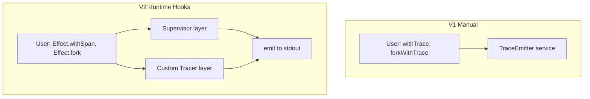

# EffectViz v2: Plain Effect Code — Workshop Spec

> Specification for the v2 workshop. Enables users to write plain (or near-plain) Effect code by replacing manual instrumentation with Effect's built-in Supervisor and Tracer APIs.

## Current State

- **V1**: Manual instrumentation via `withTrace`, `forkWithTrace`, `sleepWithTrace`, `retryWithTrace`, `addFinalizerWithTrace`, `acquireReleaseWithTrace` in `src/runtime/tracedRunner.ts`
- **WebContainer**: Runs edited programs in a container; runner.js injects `makeTraceEmitterLayer` and `runProgramWithTrace`; trace events stream over stdout
- **User code**: Must explicitly wrap every effect and fork with traced variants

## Feasibility Assessment

| Feature                                    | Effect Built-in                   | Automatic?              | Approach                                                                            |
| ------------------------------------------ | --------------------------------- | ----------------------- | ----------------------------------------------------------------------------------- |
| **Fiber lifecycle** (fork, end, interrupt) | Supervisor (`onStart`, `onEnd`)   | Yes                     | Custom Supervisor via `Layer.addSupervisor`                                         |
| **Effect spans** (start/end)               | Tracer + `Effect.withSpan`        | Semi (user still wraps) | Custom Tracer via `Layer.setTracer`; user writes `Effect.withSpan("label")(effect)` |
| **Sleep/suspension**                       | Supervisor `onSuspend`/`onResume` | Partial (no duration)   | Custom Clock wrapping sleep, or keep thin wrapper                                   |
| **Retry attempts**                         | None                              | No                      | Keep `retryWithTrace` or thin `Effect.retry` + withSpan wrapper                     |
| **Finalizers**                             | None                              | No                      | Keep `addFinalizerWithTrace`, `acquireReleaseWithTrace`                             |

**Conclusion**: Effect does not provide fully automatic tracing of arbitrary effects. The best we can achieve:

1. **Fully automatic**: Fiber lifecycle (Supervisor)
2. **Standard API, minimal change**: `Effect.withSpan` instead of `withTrace` (same wrapping pattern, but idiomatic Effect)
3. **Thin wrappers remain**: Sleep (custom Clock or wrapper), retry, finalizers

"Plain" in practice means: **Effect.fork** + **Effect.withSpan** instead of forkWithTrace + withTrace. No TraceEmitter in R. The runner provides Supervisor + custom Tracer via layers.

---

## Architecture: Runtime Hooks

**Key files to create/modify:**

- `src/runtime/vizSupervisor.ts` — Supervisor impl that emits fiber:fork, fiber:end, fiber:interrupt
- `src/runtime/vizTracer.ts` — Custom Tracer that emits effect:start, effect:end when `Effect.withSpan` runs
- `src/runtime/tracedRunner.ts` — Add `makeVizLayers(onEmit)`; tracedRunner can be phased out as programs migrate
- Runner (WebContainer): Use `makeVizLayers` (replaces `makeTraceEmitterLayer` + `runProgramWithTrace`)

---

## Workshop Phases (v2)

### Phase 6: Supervisor for Automatic Fiber Tracking

**Concept**: Effect's Supervisor is a runtime hook. When you add a Supervisor via `Layer.addSupervisor(supervisor)`, the runtime calls `onStart` when any fiber is forked and `onEnd` when it completes. No user code changes for fiber lifecycle.

**Goal**: Replace `forkWithTrace` and `runProgramWithTrace` with plain `Effect.fork`. Fibers appear automatically in FiberTreeView.

**Design**:

- Create `VizSupervisor` extending `Supervisor.AbstractSupervisor<void>`
- Implement `onStart`: emit `fiber:fork` (fiberId from `FiberId.threadName(fiber.id())`, parentId from `parent` if Some)
- Implement `onEnd`: emit `fiber:end` or `fiber:interrupt` based on Exit
- Supervisor callbacks are **synchronous** — pass a sync `(event) => void` that writes to stdout in container
- Runner provides `Layer.addSupervisor(vizSupervisor)` alongside existing layers

**Task**: Implement VizSupervisor; wire it in the runner; verify FiberTreeView works with `Effect.fork` (no forkWithTrace).

**Constraint**: Supervisor runs in the same process as the effect. In WebContainer, the sync callback must do `process.stdout.write("TRACE_EVENT:" + JSON.stringify(event) + "\n")`.

---

### Phase 7: Custom Tracer for Effect.withSpan

**Concept**: Effect's Tracer is a service. When you use `Effect.withSpan("name")(effect)`, the runtime creates a span via `Tracer.span(...)` and calls `span.end(endTime, exit)` when the effect completes. A custom Tracer can emit our TraceEvents.

**Goal**: Replace `withTrace(effect, "label")` with `Effect.withSpan("label")(effect)`. Effect spans map to effect:start/effect:end.

**Design**:

- Create `makeVizTracer(onEmit)` that returns a `Tracer` implementation
- `span(name, parent, ...)` → create a Span that stores name, startTime; on construction, emit `effect:start` (id = spanId)
- `span.end(endTime, exit)` → emit `effect:end` with result success/failure
- Provide via `Layer.setTracer(vizTracer)` (see [Effect Layer.setTracer](https://effect.website/docs))
- User code: `yield* Effect.withSpan("step-1")(Effect.succeed(42))` instead of `yield* withTrace(Effect.succeed(42), "step-1")`

**Task**: Implement makeVizTracer; wire Layer.setTracer in runner; migrate one example program to Effect.withSpan; verify ExecutionLog shows effect events.

**Note**: `Effect.withSpan` is still a wrapper — same ergonomics as withTrace, but it's the standard Effect API. No TraceEmitter in R.

---

### Phase 8: Sleep Visibility

**Options**:

| Option                               | Pros                                        | Cons                                                                           |
| ------------------------------------ | ------------------------------------------- | ------------------------------------------------------------------------------ |
| **A. Custom Clock**                  | Fully automatic; user writes `Effect.sleep` | Must implement full Clock; intercept sleep calls                               |
| **B. Supervisor onSuspend/onResume** | Automatic                                   | No duration; only "suspended" state; can't distinguish sleep from other yields |
| **C. Keep sleepWithTrace**           | Simple; already works                       | Not "plain" — user must use wrapper                                            |

**Recommendation**: Start with **Option B** for Phase 8 — use `onSuspend`/`onResume` to show "suspended" in FiberTreeView (we already support that). Duration in TimelineView would be inferred from timestamps. Option A (custom Clock) can be a later exploration if desired.

**Task**: In VizSupervisor, implement onSuspend/onResume to emit events that FiberStore can map to suspended state. Ensure TimelineView shows suspend/resume segments.

---

### Phase 9: Retry and Finalizers (Optional)

**Retry**: No built-in. Options:

- Keep `retryWithTrace` as a thin wrapper around `Effect.retry` + `Effect.withSpan`
- Or: `Effect.retry(effect, schedule)` — the Tracer will see the outer span; inner attempts are not individually visible unless we wrap

**Finalizers**: No built-in. Keep `addFinalizerWithTrace` and `acquireReleaseWithTrace` as thin wrappers. They could be refactored to use `Effect.withSpan` internally for the acquire/release span, but the finalizer event still needs explicit emit.

**Task**: Document that retry and finalizers remain as thin wrappers; optionally refactor them to use Effect.withSpan where possible.

---

## Migration Path

**Clean migration**: No backward compatibility or dual mode. Each phase updates the programs and runner to the new approach.

- **Phase 6**: Replace forkWithTrace/runProgramWithTrace with Supervisor; update all programs to use `Effect.fork`; runner uses `makeVizLayers` (Supervisor only at first).
- **Phase 7**: Add custom Tracer; update all programs to use `Effect.withSpan` instead of `withTrace`; remove TraceEmitter from imports.
- **Phase 8+**: Update programs as needed for sleep, retry, finalizers.

Each phase is a complete migration step — no coexistence with old patterns.

---

## WebContainer / Transform Considerations

- **V2 template**: User code imports only `effect`; no `./tracedRunner`. Runner provides Supervisor + Tracer via layers.
- **transformForContainer**: For V2, no import path replacement for tracedRunner. The runner.js would:
  - Import `makeVizLayers` from tracedRunner (or a new vizRuntime)
  - Build layers: `Layer.mergeAll(makeVizLayers(emitToStdout), ...requirements)`
  - Run: `Effect.runFork(program.pipe(Effect.provide(layers)))` — no runProgramWithTrace
- **Root fiber**: With Supervisor, the root fiber is also supervised. We need to emit fiber:fork for it. The Supervisor's onStart is called for every fiber including the root when it "starts". Verify: the root effect is run in a fiber, so onStart should fire.

---

## Summary: What "Plain" Means

| Before (V1)                            | After (V2)                                                 |
| -------------------------------------- | ---------------------------------------------------------- |
| `withTrace(effect, "label")`           | `Effect.withSpan("label")(effect)`                         |
| `forkWithTrace(effect, "label")`       | `Effect.fork(effect)`                                      |
| `sleepWithTrace("1 second")`           | `Effect.sleep("1 second")` + Supervisor onSuspend/onResume |
| `runProgramWithTrace(program, "main")` | `program` (runner adds Supervisor layer)                   |
| `makeTraceEmitterLayer(cb)`            | `makeVizLayers(cb)` = Supervisor + Tracer                  |

User still wraps effects with `Effect.withSpan` for granular ExecutionLog entries. Fiber tree is fully automatic.

---

## Open Questions

1. **Root fiber label**: With Supervisor, we get the root fiber's onStart. Do we need a "main" label? The effect passed to runFork is the root — we could add an attribute or use a fixed "root" label.
2. **Fiber labels**: forkWithTrace had a label. Plain `Effect.fork` has no label. We could use `FiberId.threadName` only, or allow optional `Effect.forkWith` / similar if Effect provides it. Check Effect API for fiber naming.
3. **Mobile fallback**: In-browser execution path — same layers apply; just different emit target (React state instead of stdout).
