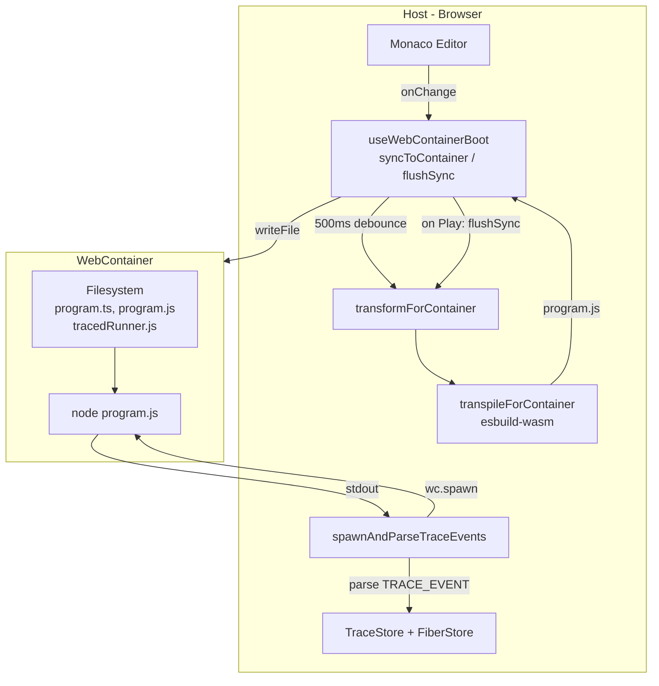
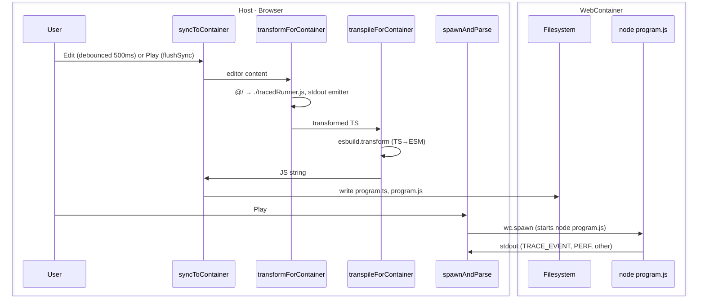
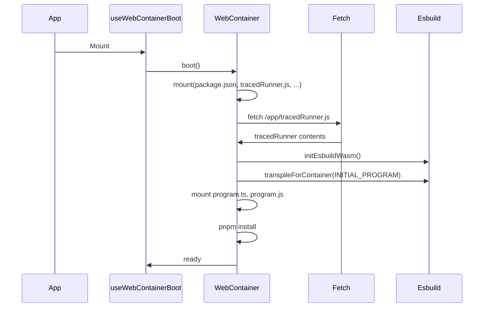
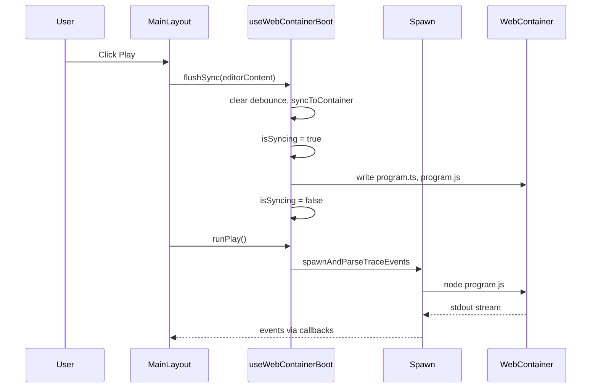

# WebContainer: Performance and Sync UX

> Documents the pre-compile optimization, sync UX improvements, and remaining work.  
> Complements [webcontainers-spec.md](./webcontainers-spec.md) and [webcontainer-impl.md](./webcontainer-impl.md).

---

## Summary

- **Pre-compile**: Transpile TS→JS on the host with esbuild-wasm, run `node program.js` in the container instead of `pnpm exec tsx program.ts`. Reduces Play→first-event from ~3.5s to ~1s.
- **Sync UX**: 500ms debounce on edit, flush-on-Play (always run latest), "Syncing..." indicator.
- **Stdout**: Lines not matching `TRACE_EVENT:` or `PERF:` come from container stdout (errors, `console.log`). Currently logged to browser console; todo: bubble to WebContainerLogsPanel.

---

## 1. Architecture Overview



**Play flow → `node program.js`:**

| Step | Action |
|------|--------|
| 1 | User clicks Play → `flushSync(editorContent)` (cancel debounce, sync now) |
| 2 | Sync → Transform → Transpile → `writeFile(program.ts, program.js)` to container |
| 3 | `runPlay()` → `spawnAndParseTraceEvents` |
| 4 | Spawn → `wc.spawn("node", ["--enable-source-maps", "program.js"])` → **`node program.js` runs** |
| 5 | Node stdout → Spawn parses `TRACE_EVENT:` lines → TraceStore + FiberStore |

---

## 2. Pre-compile Path (Implementation)

### 2.1 Problem

Running `pnpm exec tsx program.ts` in the container had ~3.5s delay from Play to first trace event due to:
- tsx startup
- TypeScript compile on demand
- Effect/tracedRunner module loading

### 2.2 Solution

| Step | Location | What |
|------|----------|------|
| 1 | Host | Transpile editor content with **esbuild-wasm** |
| 2 | Host | Write `program.ts` + `program.js` to container |
| 3 | Container | Run `node --enable-source-maps program.js` |

**Key files:**
- `src/lib/transpileForContainer.ts` — `initEsbuildWasm()`, `transpileForContainer(ts)` using esbuild-wasm CDN
- `src/lib/transformForContainer.ts` — import path `./tracedRunner.js`, trace emitter bridge, program key `"user"`
- `src/effects/spawnAndParse.ts` — spawns `node program.js`
- `src/services/webcontainer.ts` — boot: init esbuild, transpile INITIAL_PROGRAM, mount `program.js`

### 2.3 Data Flow



### 2.4 Node ESM Requirement

Node ESM requires explicit `.js` in import paths. The transform ensures:
- `@/runtime/tracedRunner` → `./tracedRunner.js`
- `./tracedRunner` → `./tracedRunner.js`

---

## 3. Sync UX (Implementation)

### 3.1 Edit Sync

- **Debounce**: 500ms after last keystroke
- **Skip**: If content equals `lastSyncedContentRef`
- **Writes**: `program.ts` (transformed), `program.js` (transpiled)

### 3.2 Play Flow

1. User clicks Play
2. `flushSync(editorContent)` — cancels debounce, syncs immediately
3. During sync: `isSyncing=true` → Play disabled, status "Syncing..."
4. After sync: `runPlay` → spawn, parse, push events

### 3.3 Key Files

- `src/hooks/useWebContainerBoot.ts`: `syncToContainer`, `syncToContainerDebounced` (500ms), `flushSync`, `isSyncing`
- `src/components/layout/MainLayout.tsx`: `onPlay` awaits `flushSync` before `handlePlay`; passes `isSyncing` to PlaybackControls
- `src/components/layout/PlaybackControls.tsx`: Shows "Syncing..." when `isSyncing`, disables Play

---

## 4. Perf Instrumentation (Implementation)

### 4.1 Enabling

- URL: `?perf=1`
- Or: `sessionStorage.setItem('perf_play','1')`

### 4.2 Host Timings (browser console)

| Label | Meaning |
|-------|---------|
| t0 | Before spawn |
| t1 | Spawn returned |
| t0→t1 | Spawn overhead (~4ms) |
| t2 | First stdout chunk |
| t1→t2 | `node program.js` runtime (~1s) |
| t3 | First TRACE_EVENT parsed |
| t0→t3 | Total Play → first event |

### 4.3 Container Timings

With `PERF_PLAY=1` env, `transformForContainer` injects:

```js
process.stderr.write("PERF: ready " + performance.now().toFixed(0) + "\n");
```

before `Effect.runFork`. Logged as `[container] ready: <ms>`.

---

## 5. Stdout Protocol

### 5.1 Tracked Prefixes

| Prefix | Purpose |
|--------|---------|
| `TRACE_EVENT:` | JSON trace event (effect:start, fiber:fork, etc.) |
| `PERF:` | Performance checkpoint from container |
| *(none)* | Anything else → from something writing to stdout inside the container |

### 5.2 Un-tracked Lines

Any line **not** starting with `TRACE_EVENT` or `PERF` comes from:

- Node.js errors (e.g. `ERR_MODULE_NOT_FOUND`) and stack traces
- User's `console.log` in their program

These are currently logged with `console.warn("[spawnAndParse] container output:", line)`.

---

## 6. Diagrams

### 6.1 Boot Sequence



### 6.2 Play Sequence (with flush)



---

## 7. Still To Do (from plan + new items)

### 7.1 From webcontainer-impl.md

- **Phase 8: Error handling and robustness**
  - Syntax/compile errors: show friendly message (e.g. "Compilation failed" + snippet) instead of raw stderr
  - Optional: timeout to kill runaway processes
- **Phase 7.2**: Optional prompt when switching programs with unsaved edits

### 7.2 Stdout / Console Output

- **Properly bubble up `console.log`** (and any stdout from the spawned process) and format it in `WebContainerLogsPanel`:
  - Currently: non-TRACE_EVENT/non-PERF lines are logged with `console.warn` in `spawnAndParse.ts`
  - Target: pass a callback from the host to `spawnAndParse` (or via store) so these lines appear in `WebContainerLogsPanel` with appropriate formatting (e.g. error styling for stack traces, neutral for user `console.log`)

### 7.3 Future Improvements

- Run prewarm with `node prewarm.js` (transpile prewarm.ts) instead of tsx
- Consider caching transpiled `program.js` when content unchanged between syncs (already skip write on unchanged content; could skip transpile too)

---

## 8. File Reference

| File | Role |
|------|------|
| `src/lib/transpileForContainer.ts` | esbuild-wasm init + TS→ESM transform |
| `src/lib/transformForContainer.ts` | Import path, trace emitter, program key, perf injection |
| `src/effects/spawnAndParse.ts` | Spawn `node program.js`, parse TRACE_EVENT, log other stdout |
| `src/hooks/useWebContainerBoot.ts` | syncToContainer, flushSync, isSyncing, runPlay |
| `src/services/webcontainer.ts` | Boot, mount, INITIAL_PROGRAM + program.js, tracedRunner.js |
| `src/components/layout/MainLayout.tsx` | onPlay with flushSync |
| `src/components/layout/PlaybackControls.tsx` | Syncing... indicator |
| `src/components/editor/WebContainerLogsPanel.tsx` | Boot logs (to be extended for stdout) |
