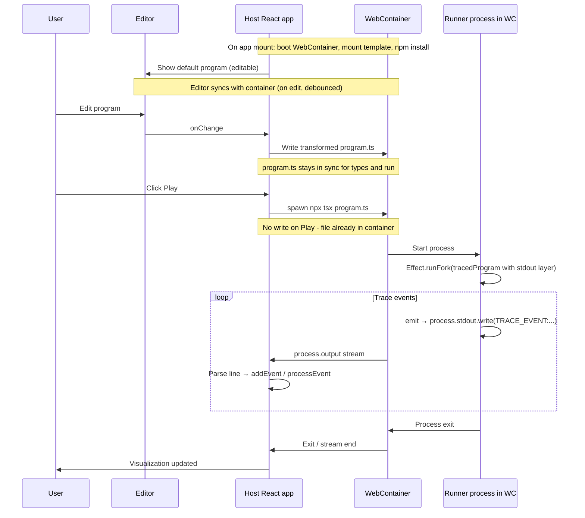
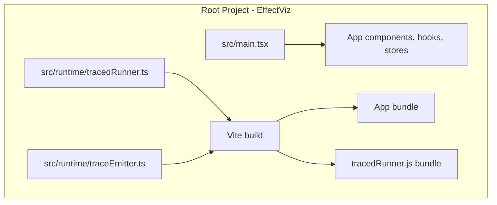
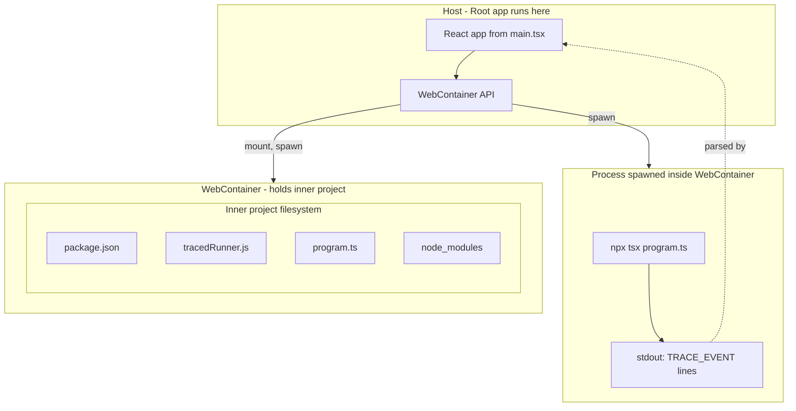

# WebContainers: Run Edited Program in Visualizer (Specification)

## Goal

- Allow the user to **edit** the program in the Program tab (editor becomes source of truth for Run).
- On **Play**, run the **edited** program inside a WebContainer and stream **trace events** back to the host so the existing ExecutionLog and FiberTreeView still work.
- Keep using the current trace utils (`withTrace`, `forkWithTrace`, etc.) in user code; no v2 runtime hooks yet.

## Current vs target flow

**Current:** Program is chosen from dropdown → source is shown read-only in editor → Play runs the in-memory `programs[key].program` in the host via `useEventHandlers.ts` with `makeTraceEmitterLayer(callback)` → callback pushes to trace/fiber stores.

**Target:** Program tab is **editable**. The **WebContainer boots on app mount** (not on Play). Editor shows immediately with a default program. Play runs **editor content** inside the already-ready WebContainer. Code in the container uses the same trace utils; a **bridge** sends trace events from the container to the host; the host pushes those events into the same trace/fiber stores so the UI is unchanged.

---

## 1. WebContainer boot and install sequence

- **Dependency:** Add `@webcontainer/api` (ask user for permission before installing).
- **Boot on app mount:** Call `WebContainer.boot()` as soon as the app mounts (e.g. in a `useEffect` in the root layout or a dedicated provider). Do not wait for the user to click Play. Store the instance in React context or a module singleton.
- **Editor first:** The Monaco editor and program selector must render immediately with a default program. The WebContainer boot and install run in the background. Show a loading/ready indicator if needed (e.g. "Preparing environment…" / "Ready to run").
- **Install sequence (inside the container):**
  1. After `WebContainer.boot()` completes, mount the inner project template (package.json, tracedRunner bundle, initial program.ts).
  2. Run `npm install` in the container. This installs `effect`, `typescript`, `tsx` (and any other dependencies in the inner project's package.json).
  3. **Effect types:** The `effect` package ships with its own TypeScript type definitions. When `npm install effect` runs in the container, `node_modules/effect` includes both the runtime and `*.d.ts` files. This single install supplies types for both: (a) execution in the container (tsx resolves from `node_modules/effect`), and (b) Monaco editor type hints in the host. After `npm install` completes, read the Effect type definitions from the container (via `webcontainerInstance.fs.readFile` on `node_modules/effect` — follow `package.json` "types" field, recurse for `*.d.ts`) and add them to Monaco with `addExtraLib`. Also add **tracedRunner types**: emit `tracedRunner.d.ts` from the bundle build (or hand-maintain) so `import { withTrace } from './tracedRunner'` resolves in Monaco. **Ditch `editor-bundled-definitions.d.ts`** — Monaco relies entirely on types from the container's npm install at boot.
- **Headers (required for SharedArrayBuffer):** Set COOP/COEP on the deployed app. The Effect website sets them on the playground route and in `vercel.json` for Monaco workers (`editor.worker`, `ts.worker`, `json.worker`). Ensure both the page and worker URLs get the headers. For Vite, adjust paths to match the build output:
  - `Cross-Origin-Embedder-Policy: require-corp`
  - `Cross-Origin-Opener-Policy: same-origin`
- **HTTPS:** Deployed app must be served over HTTPS (localhost is exempt). Document this for production (e.g. Vercel).

---

## 2. Project structure: root vs inner project

There are two distinct "projects":

**Root project (EffectViz)** – The React app that runs in the browser:
- `src/` – App code (components, hooks, stores, etc.)
- `package.json` – React, Vite, Effect, Monaco, etc.
- Build produces the app bundle and a **container bundle** (tracedRunner) for the inner project.

**Inner project** – A self-contained Node project that lives **inside** the WebContainer filesystem. It has:
- **Its own package.json** – Dependencies: `effect`, `typescript`, `tsx`. This is the project we run `npm install` on inside the container.
- **tracedRunner.js** – Bundled from the root's `tracedRunner.ts` and `traceEmitter.ts`. Built as part of the root project (e.g. Vite lib mode or esbuild), output to a path that gets mounted. **Unmangle:** The bundle must preserve export names (`withTrace`, `forkWithTrace`, `makeTraceEmitterLayer`, `runProgramWithTrace`, etc.) so the user's code can `import { withTrace, forkWithTrace, ... } from './tracedRunner'`. Use `minify: false` or equivalent `keepNames` so the API stays usable.
- **program.ts** – User's edited content (transformed before write). Synced to the container as the user edits (debounced), not only on Play. Keeps the container in sync for types and runtime.

**Project structure (build):**

**What lives where at runtime:**

- **Root:** Starts at `src/main.tsx`. React app, uses WebContainer API to boot, mount the inner project, and spawn processes.
- **Inner project:** Lives in the WebContainer filesystem. Contains package.json, tracedRunner.js (from root build), program.ts (synced from editor), node_modules.
- **Spawned process:** Runs inside the WebContainer when user clicks Play. Executes `npx tsx program.ts`. Emits trace events to its stdout.
- **Root parses:** Reads the process output stream, parses `TRACE_EVENT:` lines, pushes to trace/fiber stores.

---

## 3. Project template mounted in the container

Mount the inner project so we can run the user's TypeScript with Effect and our trace runtime.

**Files to mount (conceptually):**

- **package.json** – Inner project's own dependencies: `effect`, `typescript`, `tsx`.
- **tsconfig.json** (optional) – For consistent TypeScript behavior in the container (module, moduleResolution, target).
- **tracedRunner.js** – Bundled from root (see above). No minification of export names. User's code does `import { withTrace, forkWithTrace, ... } from './tracedRunner'`.
- **program.ts** – Synced from the editor as the user edits (debounced); transformations applied before write. Keeps the container in sync for types and runtime.

**No separate "runner" process file is required** if the user's file is self-contained and ends with `Effect.runFork(tracedProgramWithLayer)`: we run that file with `npx tsx program.ts` and it will emit events and exit when the effect completes.

---

## 4. Transforming editor content and syncing to the container

The editor syncs with the container filesystem as the user edits (debounced, e.g. 2 seconds after typing stops — reduces write frequency; see Effect website). This keeps `program.ts` in the container up to date for:
- **Types and diagnostics:** Run `tsc --noEmit` (or similar) in the container to get accurate errors, using real module resolution (`effect` from node_modules, `./tracedRunner` from the bundle). The container is the source of truth.
- **Play:** No write step on Play — the file is already there; we only spawn.

When syncing (on edit or when loading a built-in program), take the **Program** tab value and:

1. **Import path:** Replace `@/runtime/tracedRunner` (and any `@/` alias) with the container path to the tracedRunner bundle, e.g. `./tracedRunner`.
2. **Trace emitter bridge:** Replace the **callback** passed to `makeTraceEmitterLayer(...)` with one that sends events to stdout in a **protocol** the host can parse. For example: `TRACE_EVENT:<JSON.stringify(event)>\n`. So the layer becomes something like: `makeTraceEmitterLayer((event) => process.stdout.write("TRACE_EVENT:" + JSON.stringify(event) + "\n"))`.
3. **Program key:** `runProgramWithTrace(program, "…")` can use a fixed id for "user" runs, e.g. `"user"`.

After these transformations, write the result to the container as `program.ts`. This happens on each sync (debounced on edit) and when loading a built-in program into the editor.

---

## 5. Running the program and streaming trace events

The content executed (`program.ts`) is the **transformed** file: the user's Effect program wrapped with `runProgramWithTrace`, `Effect.provide(makeTraceEmitterLayer(...))`, and `Effect.runFork`. The layer's callback streams trace events to stdout (`TRACE_EVENT:` + JSON). So the spawn runs the full routine, not raw user code.

- **Spawn:** Use `webcontainerInstance.spawn('npx', ['tsx', 'program.ts'], { output: true })`. Do **not** set `output: false`.
- **Output stream:** Read from `process.output` (`ReadableStream<string>`), split by newlines, and for each line: if it starts with `TRACE_EVENT:`, strip the prefix, `JSON.parse` the rest, and push to `addEvent(event)` and `processEvent(event)`.
- **Completion and errors:** When the process exits, resolve the "run" promise. Surface friendly errors for non-zero exit or parse errors.
- **Interrupt (Reset):** Kill the spawned process, then clear trace/fiber stores.

---

## 6. Editor and app behavior

- **Program tab:** Make the Program tab **editable**. When the user selects a built-in program from the dropdown, load that program's `source` into the Program tab (optionally prompt if the current editor content is modified).
- **Single run path:** Always run via WebContainer when the user clicks Play.
- **When Play is clicked:** The container is already booted, `npm install` is done, and `program.ts` is already in sync (from edit sync). We only spawn and stream events.

---

## 7. Error handling and robustness

- **Syntax/compile errors:** `tsx program.ts` will fail with non-zero exit; stderr appears on the output stream. Show a friendly message.
- **Runtime errors:** Effect failures are trace events; let the process exit normally.
- **Timeouts (optional):** Kill the process after a max duration for runaway effects.
- **Isolation:** The program runs entirely inside the WebContainer; host and visualizer stay stable.

---

## 8. Files and responsibilities (summary)

| Area | Responsibility |
|------|----------------|
| **Host** | Boot WebContainer on app mount; mount template; run `npm install` in container; on edit (debounced) and when loading built-in: transform editor content, write `program.ts`; on Play: spawn, read output stream, parse `TRACE_EVENT:` lines, push to trace/fiber stores; on Reset: kill process and clear stores. |
| **Container template** | Minimal Node project with its own package.json (effect, typescript, tsx), tracedRunner bundle (from root, unmangled), program.ts (written at runtime). |
| **Editor** | Program tab editable; dropdown loads built-in source; shows before Play. |
| **Deployment** | COOP/COEP headers (e.g. in `vercel.json`); HTTPS in production. |

---

## 9. Out of scope for this spec

- **v2 (runtime hooks):** Removing trace utils is out of scope.
- **Interactive terminal:** No user-facing terminal in v1.
- **Preview iframe:** Separate design (visualizer UI inside vs outside container).

---

## 10. Feedback from Effect website playground

Reference: `/Users/tophe/.local/share/reference-repos/effect-website/content/src/components/editor`

The Effect website implements Monaco + WebContainer in `content/src/components/editor`. Below are findings that can improve our spec. We do **not** need all features (multi-file workspace, interactive terminal, DevTools socket, pnpm, dprint formatters, share/reset, etc.).

### Sync model (editor ↔ container)

- **Effect site:** `readFile(path)` reads from container → `model.setValue(content)` → stream `editor.content` (drop first) → debounce **2 seconds** → `writeFile` to container. Two-way: container is source on load; editor edits flow back (debounced).
- **Our case:** Single `program.ts`; editor is source. We transform before write. **Recommendation:** Use 2s debounce (fewer writes). Initial load: set editor from built-in source, trigger one write to container. No need for container→editor read for program content.

### Monaco model and URI

- **Effect site:** Uses `monaco.Uri.file(path)` where `path` is the container path (e.g. `playground/src/main.ts`). Model and container path align.
- **Our case:** User edits the **display** version (with `@/` imports); we write the **transformed** version to container. Monaco model content ≠ container content. Model URI can still use container path (e.g. `playground/program.ts`) for TypeScript resolution.

### Type acquisition

- **Effect site:** `setupWorkspaceTypeAcquisition` traverses `node_modules/.pnpm` (pnpm store), reads `package.json` and `*.d.ts`, adds to Monaco with `addExtraLib(path, content)`. Watches `package.json` for dep changes. Uses `monaco.languages.typescript.typescriptDefaults.setEagerModelSync(true)` and compiler options.
- **Our case:** npm (simpler). Read `node_modules/effect` (no pnpm store). Follow `package.json` "types" field for main entry; recurse into subdirs for `.d.ts`. We also need **tracedRunner types** — add a `tracedRunner.d.ts` (emit from our bundle build or hand-maintain) as extra lib so `import { withTrace } from './tracedRunner'` resolves.

### Loader UX

- **Effect site:** Multi-step loader (`Loader` service): "Booting webcontainer", "Preparing workspace", "Configuring editor", "Starting playground". Each step shows spinner then checkmark. Uses `withIndicator(message)` around Effect operations.
- **Recommendation:** Adopt a similar step-based loader (e.g. "Booting WebContainer", "Installing dependencies", "Loading types", "Ready") rather than a single "Preparing…" message.

### COOP/COEP headers

- **Effect site:** `Astro.response.headers.set` on the playground route **and** `vercel.json` for Monaco workers: `/_astro/editor.worker-(.*)`, `/_astro/ts.worker-(.*)`, `/_astro/json.worker-(.*)`.
- **Our case:** Vite serves from a different path. Ensure COOP/COEP apply to the **page** that runs the playground and to **Monaco worker** URLs (check Vite’s output paths for workers).

### Single WebContainer instance

- **Effect site:** `GlobalValue.globalValue("app/WebContainer/semaphore", () => Effect.unsafeMakeSemaphore(1))` — only one instance.
- **Our case:** Same constraint; boot once, store in context/singleton.

### Spawn and run

- **Effect site:** Spawns `jsh` (shell), runs `cd workspace && command`. Uses `tsc-watch` + `node` for compile-and-run. Custom `run` executable.
- **Our case:** Simpler: spawn `npx tsx program.ts` directly. No shell needed.

### Inner project layout

- **Effect site:** Workspace has `package.json`, `tsconfig.json`, `dprint.json`, `src/main.ts`, etc.
- **Recommendation:** Add `tsconfig.json` to the inner project for consistent TypeScript behavior (module, moduleResolution, target). Keep it minimal.

### Service / Layer pattern (optional)

- **Effect site:** Uses `Effect.Service` (WebContainer, Monaco, Loader, Terminal) with `Layer` and scoped resources. Effect-based architecture.
- **Our case:** React + hooks is fine. If we later want Effect-based orchestration, the Effect site’s patterns (WebContainer as a scoped service, `readFile`/`writeFile` abstraction) are a good reference.

### Frontend Hire Stackpack course

Reference: [Stackpack – Sandpack clone with WebContainers](https://www.frontendhire.com/learn/frontend/courses/stackpack/overview) (React, TypeScript, no Effect)

Simpler, production-oriented approach. Relevant hints:

- **Headers in dev:** Set COOP/COEP in `vite.config.ts` under `server.headers` for local development. Production uses `vercel.json`.
- **Boot pattern:** `WebContainer.boot()` in `useEffect`, store instance in `useState<WebContainer | null>(null)`. Pass to children as needed.
- **Teardown:** [Known issue](https://github.com/stackblitz/webcontainer-core/issues/1125) — WebContainer `teardown()` may not work correctly. Course comments out cleanup. Document this if we add teardown.
- **Mount format:** Use WebContainer `FileNode` format: `{ filename: { file: { contents: string } } }`. `container.mount(files)` accepts this directly.
- **Editor sync:** Course uses `onChange` → `webContainer.fs.writeFile(path, content)` on every keystroke (no debounce). Our spec uses debounce to reduce writes.
- **Vercel:** Simple `vercel.json` with `"source": "/"` and COOP/COEP headers. [WebContainers config guide](https://webcontainers.io/guides/configuring-headers#vercel).
- **Preview:** Uses `webContainer.on('server-ready', (_, url) => ...)` and iframe for dev-server output. We don't need this — we spawn a process and read stdout.
- **Dependencies:** `@webcontainer/api`, `@monaco-editor/react`, `react-resizable-panels`. We already use Monaco; we don't need xterm/terminal for v1.

---

## 11. Implementation order (suggested)

_See section 10 for Effect website reference and recommendations._

1. Add COOP/COEP headers and `vercel.json` so WebContainers can boot in production.
2. Add `@webcontainer/api`. On app mount: boot WebContainer, mount template (package.json + tracedRunner bundle + initial program.ts), run `npm install`. Show editor with default program; show "Preparing…" / "Ready" indicator.
3. Implement the stdout protocol (layer writes `TRACE_EVENT:...`; host parses and pushes to stores). Verify UI shows events when running a hardcoded program.
4. Implement editor-container sync: on edit (debounced) and when loading built-in, transform and write `program.ts` to container. Wire Play to: spawn → stream events (no write; file already in sync). Make Program tab editable.
5. Implement Interrupt (kill process) and basic error display for failed runs.

---

## Resources

- [Effect website – editor component](https://github.com/Effect-TS/website/blob/main/content/src/components/editor/index.tsx)
- [WebContainers introduction](https://webcontainers.io/guides/introduction)
- [WebContainers (video)](https://www.youtube.com/watch?v=uA63G1pRchE)
- [Frontend Hire – Stackpack course](https://www.frontendhire.com/learn/frontend/courses/stackpack/overview)
